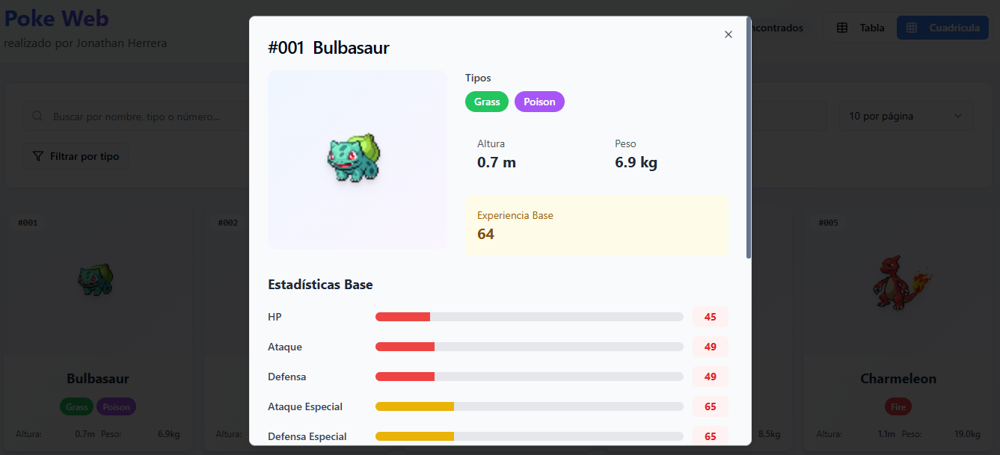
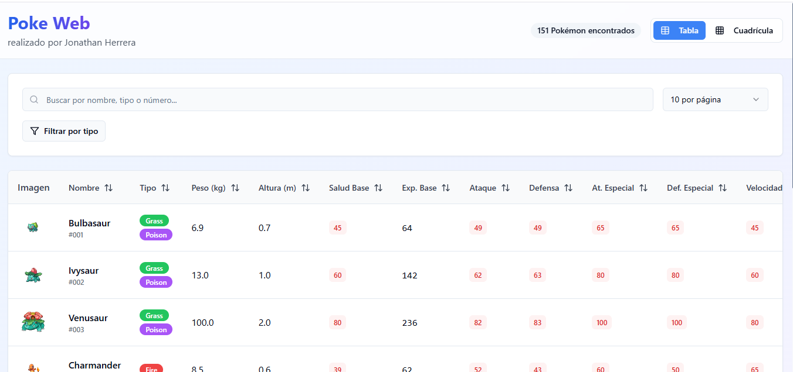
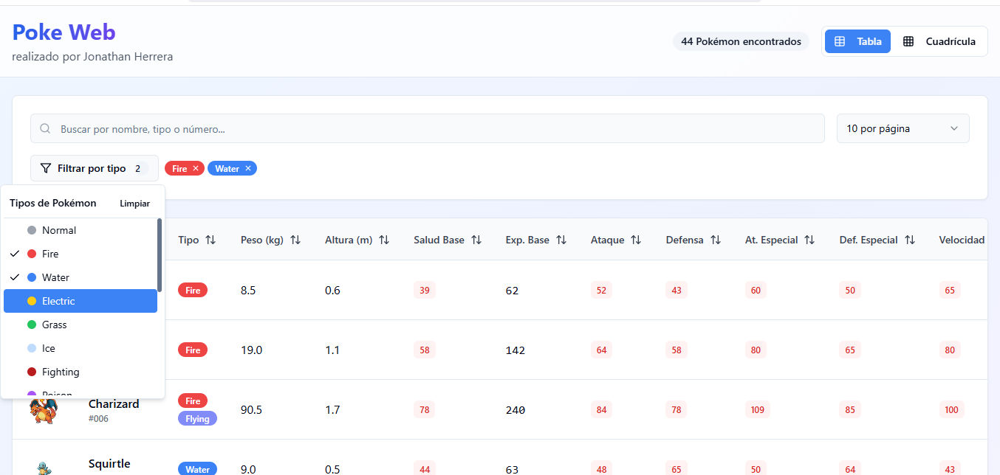
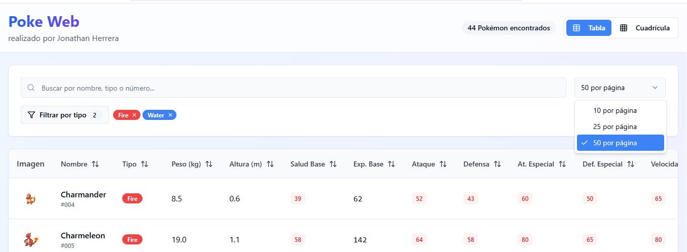
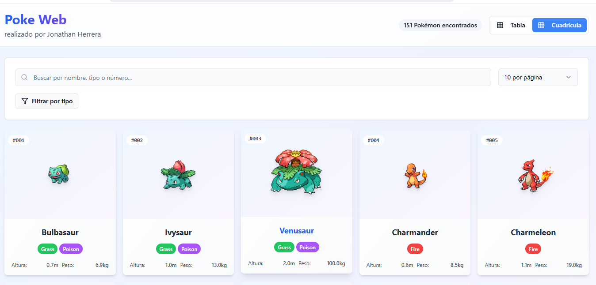

Poke Web
https://i.imgur.com/placeholder.png (Reemplaza con una captura real de tu app)

Poke Web es una aplicación interactiva que permite buscar y filtrar Pokémon por nombre, tipo, número y más. Desarrollada con fines practicos, muestra estadísticas detalladas de cada Pokémon en una interfaz amigable.

🌟 Demo
🔗 Prueba la demo aquí

https://poke-web.onrender.com/

🛠️ Instalación local
Clona el repositorio:

git clone https://github.com/JonathanHerrera09/poke-web.git  
cd poke-web  
Instala dependencias:

npm install  # o `yarn install` si usas Yarn  
Ejecuta el proyecto:

npm run dev    # o `yarn run dev`  

✨ Características
✅ Búsqueda por nombre, tipo o número de Pokémon.

✅ Filtrado avanzado por tipos (Grass, Fire, etc.).

✅ Tabla comparativa con stats como peso, altura, ataque, defensa, etc.

✅ Diseño responsive y visualización detallada por Pokémon.

🛠️ Tecnologías usadas
Frontend: React.js, HTML/CSS, tailwind, PokeAPI.

Despliegue: Render (alternativa: GitHub Pages).

📌 Notas
Si encuentras bugs o quieres contribuir, ¡abre un Issue o Pull Request!

